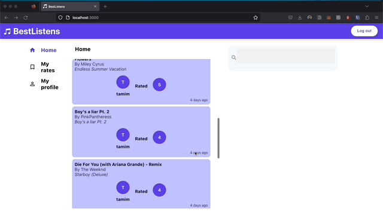

# Best Listens 

Best Listens is a social music rating web application where you and your friends can rate songs and see what your community rates popular songs.

This proof-of-concept application developed using microservices architecture comprises of four microservices: a music microservice, a user microservice, a feed microservice, and a front-end microservice. The music microservice provides access to a database of music tracks, which can be searched and rated. The user microservice manages user authentication and authorization, as well as user profile management. The feed microservice aggregates user activity data, such as ratings and followers, and displays them in a personalized feed. The front-end microservice is the user-facing component of the application, providing a web-based interface for accessing the functionality of the other microservices.

The microservices communicate with each other using REST APIs, and data is stored in PostgreSQL, and SQLite databases. The application is containerized using Docker. The front-end microservice is built using React, and it communicates with the other microservices using the Axios library.

The application is designed to be scalable, maintainable, and easily extensible. It leverages modern technologies and best practices in software engineering, and it provides a robust foundation for building a comprehensive music rating service.

More details can be found in 'report.pdf'.

## Quick look

Registration, authentication, login functionality.  
  
What the app looks like after logging in.  
  

## Pre-requisites

Ensure you have [Docker Desktop downloaded](https://docs.docker.com/compose/install/#:~:text=Scenario%20one%3A%20Install%20Docker%20Desktop,Linux) and running on your machine to connect containers and images

## Start the app using Docker
Within the root directory, use the following command to start the applications:

### `$ docker-compose up`

Ensure that docker desktop is running 

Runs the app in the dockerized mode. 
Open [http://localhost:3000](http://localhost:3000) to view it in the browser.

Starts the following containers in order:
- postgres
- musicMicroservice
- userMicroservice
- feedMicroservice
- front-end

## Test the app
1. Before you login, you will be shown a page with limited view.
2. Click on the Login button and then click 'Register'
3. You may use these dummy details to sign up as a test user: 
username: tester 
email: test@test.com 
password: Water123 
4. Login with the same details to test the app - you will see more of the app functionality now
5. You may now register some more dummy users per steps 2 and 3 to test the following functionality. Also rate some songs while you're logged in as different users.
6. After logging in as 'tester', the feed will generate with the most recent ratings of the users you follow. You may also search for, and view their profiles now.

## License
Best-Listens is available under the MIT license. See the LICENSE file for more info.

## Acknowledgements
University of Surrey project team:
[Tamim Almahdi](https://www.linkedin.com/in/talmahdi/) • [Muhammad Ali Tahir](https://www.linkedin.com/in/ali-tahir-847419243/) • [Rudra Someshwar](https://www.linkedin.com/in/itsrudra/) • [Jamie Prestwich](https://www.linkedin.com/in/james-prestwich/) • Alam Majid 

Project supervisor: [Professor Nishanth Sastry](https://www.surrey.ac.uk/people/nishanth-sastry)
